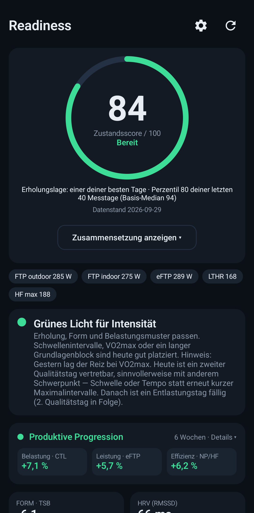
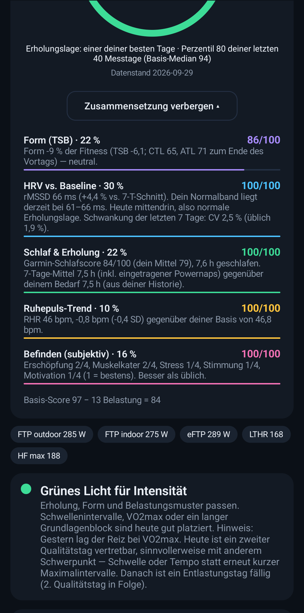
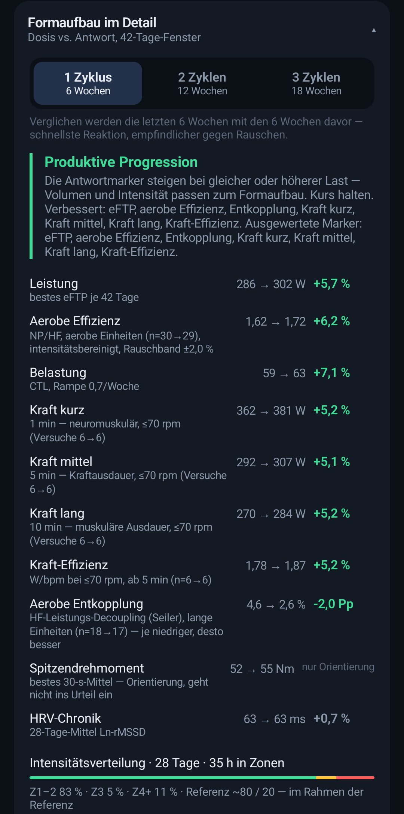
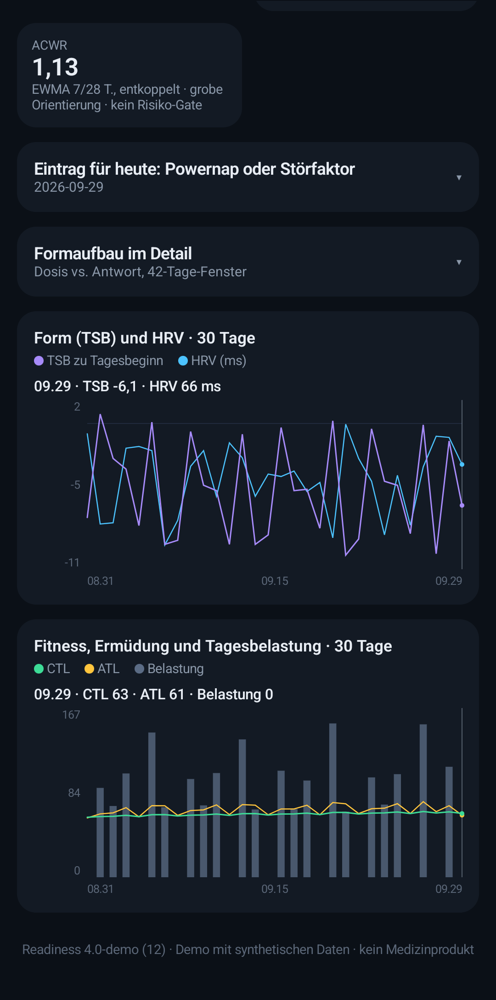
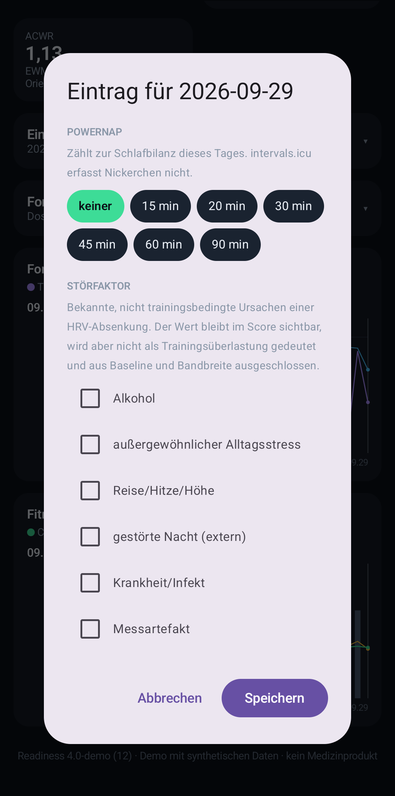

# Readiness

**Trainingsbereitschaft und Formaufbau für Ausdauersportler, auf Basis von
[intervals.icu](https://intervals.icu).** Die Android-App liest jeden Morgen HRV, Ruhepuls, Schlaf,
dein Befinden und die Trainingslast und macht daraus einen Tageswert mit einer klaren Empfehlung:
Intensität, nur Grundlage oder Ruhetag. Dazu kommt eine Formaufbau-Karte. Sie zeigt, ob die
Trainingslast auch zu messbar mehr Leistung führt.

  
  
  
  
  

Screenshots aus der Demo-Variante mit einem synthetischen Athleten, keine echten Messwerte.

> **English summary:** Readiness is an Android app for **daily training readiness and fitness
> progression**, built on the intervals.icu API. Each morning it combines HRV (7-day ln-rMSSD trend
> against a 60-day individual baseline), resting heart rate, sleep, subjective wellness and training
> load into a score. It then gives a traffic-light recommendation: intensity, easy only, or rest.
> Single noisy days do not trigger alarms. Decisions need a trend or a second, independent marker.
> A progression card compares training dose (CTL) with response (eFTP, aerobic efficiency,
> decoupling, low-cadence strength), with a per-marker noise band. Thresholds are calibrated by
> Monte Carlo simulation. **The app UI is German only.** Download the APK from the
> [latest release](https://github.com/Joris273/readiness-intervals/releases/latest).
> Not a medical device. Not affiliated with intervals.icu.

---

## Funktionen

- **Tageswert und Ampel:** HRV, Ruhepuls, Schlaf, Befinden und Form ergeben einen Wert von 0–100.
  Die Empfehlung lautet „Grünes Licht für Intensität“, „Nur Grundlage“ oder „Ruhetag“, jeweils mit
  Begründung.
- **HRV wie in der Trainingssteuerung üblich:** Entschieden wird über das 7-Tage-Mittel der
  Ln-rMSSD gegen dein persönliches Normalband aus bis zu 60 Tagen (Plews, Vesterinen). Ein einzelner
  schwacher Morgen löst keinen Alarm aus. Eine hohe HRV bei hoher Last oder unruhigen Tageswerten
  wird nicht als „topfit“ gewertet, denn sie kann auf funktionelle Überlastung hindeuten.
- **Alles gegen deine eigene Norm:** Ruhepuls, Garmin-Schlafscore und Befinden werden gegen deine
  übliche Schwankung bewertet, nicht gegen feste Grenzen. Der Schlafbedarf kommt aus deiner
  Historie, liegt aber nie unter 7 Stunden.
- **Kein Wegbügeln:** Ein kritischer Wert in einem Bereich wird nicht durch gute Werte woanders
  ausgeglichen. Einen Ruhetag erzwingt ein Befund aber erst, wenn ein zweiter Marker ihn bestätigt.
- **Belastung mit Verstand:** Harte Einheiten werden am Anteil der Fahrzeit in hohen Zonen erkannt.
  Ein zweiter Qualitätstag ist erlaubt, wenn die Erholungswerte stimmen. Nach dem dritten in Folge
  ist Entlastung fällig. Die Form wird relativ zur Fitness bewertet (TSB in % der CTL).
- **Formaufbau:** Dosis (CTL) gegen Antwort: eFTP, aerobe Effizienz (um Intensität und
  Rolle/Straße bereinigt), Entkopplung und Kraft bei niedriger Trittfrequenz. Jeder Marker hat sein
  eigenes Rauschband. Bestwerte zählen als Rückgang nur, wenn wirklich ein Maximalversuch gefahren
  wurde.
- **Tageseintrag:** Powernaps und Störfaktoren wie Alkohol, Reise, Krankheit oder Messartefakt. Sie
  werden aus der Baseline ausgeschlossen und ändern die Deutung, nicht den Messwert.
- **Homescreen-Widgets** und ein **Morgenlauf** mit Benachrichtigung, sparsam über WorkManager.

## Installation

Die neueste APK findest du unter
**[Releases](https://github.com/Joris273/readiness-intervals/releases/latest)**.

1. Auf dem Handy die APK herunterladen und öffnen. Android fragt einmalig, ob Installationen aus
   dieser Quelle erlaubt sind.
2. Oder per PC mit USB-Debugging: `adb install readiness-4.0.apk`.
3. In der App unter ⚙ den **intervals.icu-API-Key** eintragen (intervals.icu → Settings →
   Developer Settings). Optional kannst du den eigenen Schlafbedarf eintragen.
4. Für die Werte brauchst du HRV, Ruhepuls und Schlaf in intervals.icu, etwa über Garmin, Oura
   oder Apple Health. Befinden trägst du in intervals.icu unter Wellness ein. Mit Leistungsmesser
   und Streams wird die Formaufbau-Karte vollständig.

Der API-Key liegt verschlüsselt im Android Keystore des Geräts. Die App spricht ausschließlich mit
intervals.icu.

## Entwicklung

Bauen, Testen, Signieren, Demo-Variante und Aufbau des Codes: **[ENTWICKLUNG.md](ENTWICKLUNG.md)**.

- `app/`: Android-App (Kotlin, Jetpack Compose, Glance, WorkManager), 93 Unit-Tests
- Die gesamte Auswertung (`domain/`) ist reines Kotlin ohne Android und ohne Emulator testbar.
  Alle Schwellen stehen an einer Stelle (`ScoringParams.kt`) und sind per Monte-Carlo-Simulation
  kalibriert. An unauffälligen Tagen zeigt die App in rund 6 % der Fälle nicht GRÜN, eine echte
  HRV-Absenkung erkennt sie zu 94 %.

## Wissenschaftliche Grundlagen

Plews et al. 2012/2013 und Vesterinen et al. 2016 (HRV-gesteuertes Training) · Kiviniemi et al.
2007 · Le Meur et al. 2013 (parasympathische Sättigung) · Saw et al. 2016, Hooper & Mackinnon 1995
(subjektive Marker) · Walsh et al. 2021 (Schlaf) · Hopkins 2000 (Rauschband, kleinste bedeutsame
Änderung) · Foster 1998 (Monotonie) · Williams et al. 2017, Impellizzeri et al. 2020 (ACWR) ·
Rønnestad et al. (Blockperiodisierung) · Coggan (Form in % der Fitness).

## Hinweise

- Privates Projekt, **kein Medizinprodukt** und nicht mit intervals.icu verbunden. Die Empfehlungen
  ersetzen weder Trainer noch Arzt. Bei Krankheit gilt immer: pausieren.
- Fehler und Ideen bitte als [Issue](https://github.com/Joris273/readiness-intervals/issues) melden.

## Lizenz

[MIT](LICENSE)
